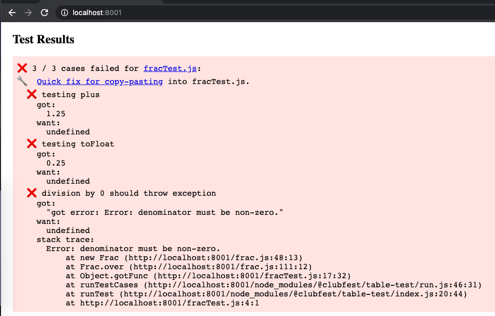
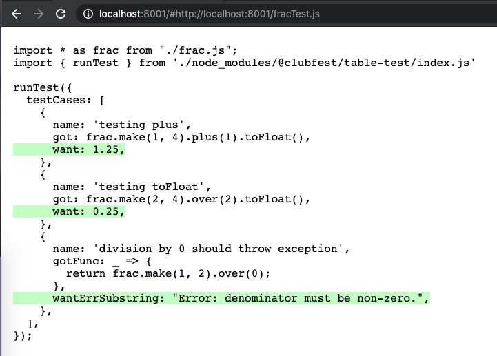
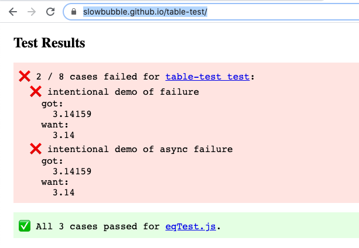

# Objective

`table-test` is a library inspired by Golang's data-driven, table-driven testing:

* Just specify the data you want to compare for each test case, and call the main library function `runTest` using the test cases.
  - `runTest` will display a summary of the results in the console for Node.js and in the browser for frontend javascript.
* If the function under testing is implemented correctly, the library will auto-generate the expected JSON for the test case.
  - For frontend javascript, the auto-generated test code link is in the test report; all you need to do is copy-paste the code.
  - For Node.js, the test code (e.g. allTests.js) can be updated via the `autofix.js` script:
    + `node allTests.js | npx @clubfest/table-test`


# Real-life example

- Suppose we have a fraction library with these cases that we want to test:

  | name            | got                               | want                                 |
  |-----------------|-----------------------------------|--------------------------------------|
  | testing plus    | frac.make(1, 4).plus(1).toFloat() | 1.25                                 |
  | testing divide  | frac.make(2, 4).over(2).toFloat() | 0.25                                 |
  | division by 0   | frac.make(1, 2).over(0)           | Error: denominator must be non-zero. |

- The test code you need to write using `table-test` would be:

  ```js
  // fracTest.js
  import * as frac from "./frac.js";
  import { runTest } from './node_modules/@clubfest/table-test/index.js'

  runTest({
    testCases: [
      {
        name: 'testing plus',
        got: frac.make(1, 4).plus(1).toFloat(),
      },
      {
        name: 'testing toFloat',
        got: frac.make(2, 4).over(2).toFloat(),
      },
      {
        name: 'division by 0 should throw exception',
        gotFunc: _ => {
          return frac.make(1, 2).over(0);
        },
      },
    ],
  });
  ```

## Viewing and fixing test results in Node JS
- In Node.js, the test can be run via:

  ```
  $ node fracTest.js 

  ----------------------------------------

  ❌ 3 / 3 cases failed for fracTest.js:
    ❌ testing plus
      got:
        1.25
      want:
        undefined
    ❌ testing toFloat
      got:
        0.25
      want:
        undefined
    ❌ division by 0 should throw exception
      got:
        "got error: Error: denominator must be non-zero."
      want:
        undefined
      stack trace:
        Error: denominator must be non-zero.
            ...

  🔧 To auto-fix the above test (i.e. assuming that the implementation is correct), run the following:
      /usr/local/n/versions/node/10.16.0/bin/node fracTest.js | npx @clubfest/table-test
  ```

- To autofix the test, assuming that the implementation is correct, i.e. the `got` values are as expected, run this:

  ```
  $ node fracTest.js | npx @clubfest/table-test 
  🔧🔧 file:///.../fracTest.js has been autofixed!
  ```

Caveat:
* autofix updates the code irreversibly. To undo the change, make sure you have that the original file is version-controlled or opened in an editor before running autofix.
* autofix only works for nicely formatted code, i.e. each field is on a separate line, and each test case has a name that is unique within the test file.

## Viewing and fixing test results in Browser JS

- To run the test in the browser, set up an html page (index.html) that imports the test as a module, and visit the page via a local server:

  ```html
  <!DOCTYPE html>
  <html>
    <head>
      <script type='module' src='fracTest.js'></script>
    </head>
  <body>
  </body>
  </html>
  ```

  


- To auto-fix the test, assuming that the implementation is correct, click on the `Quick fix` link and copy-paste the content into your test file:

  

# Another long example in both Node.js and the browser.
First, install the package as a dev dependency (or copy the repo into your project):
```
$ npm i --save-dev @clubfest/table-test
```

Terminal:
```
$ node allTests.js 
...
✅ All 3 cases passed for eqTest.js.
❌ 2 / 8 cases failed for table-test test:
  ❌ intentional demo of failure
    got:
      3.14159
    want:
      3.14
  ❌ intentional demo of async failure
    got:
      "got error: testing reject"
    want:
      3.14
```

allTests.js:
```js
import './eqTest.js';
import './indexTest.js';
```

indexTest.js:
```js
import { runTest } from './index.js'

runTest({testName: 'table-test test', testCases: [
  {
    name: 'testing number',
    got: 1,
    want: 1,
  },
  {
    name: 'testing object equality',
    got: {a: 1, b: 2},
    want: {b: 2, a: 1},
  },
  {
    name: 'testing exception',
    gotFunc: _ => {
      throw 'testing exception';
    },
    wantErrSubstring: "testing",
  },
  {
    name: 'testing async',
    gotFunc: _ => {
      return new Promise(resolve => {
        setTimeout(_ => {
          resolve(3.14);
        }, 9);
      });
    },
    want: 3.14,
  },
  {
    name: 'intentional demo of failure',
    got: 3.14159,
    want: 3.14,
  },
  {
    name: 'intentional demo of async failure',
    gotFunc: _ => {
      return new Promise((resolve, reject) => {
        setTimeout(_ => {
          reject('testing reject');
        }, 9);
      });
    },
    want: 3.14,
  },
  {
    name: 'testing custom comparisonFunc',
    got: 3.14159,
    want: 3.14,
    comparisonFunc: (got, want) => {
      return Math.abs(got - want) < 0.01;
    },
  },
  {
    name: 'testing async error',
    gotFunc: _ => {
      return new Promise((resolve, reject) => {
        setTimeout(_ => {
          reject('testing reject');
        }, 9);
      });
    },
    wantErrSubstring: 'testing',
  },
]});
```

To run the tests in the browser, just import the script that contains the `runTest` call in the html page:

Demo: [https://slowbubble.github.io/table-test/](https://slowbubble.github.io/table-test/)

index.html:
```html
<!DOCTYPE html>
<html>
  <head>
    <script type='module' src='allTests.js'></script>
  </head>
<body>
</body>
</html>
```

Result:



# Caveat
Some test setup may require the test to exit explicitly, in which you would need to run the test like this from allTests.js:

```js
import { isNodeJs } from './index.js'
import eqTest from './eqTest.js';
import indexTest from './indexTest.js';

(async _ => {
  await indexTest();
  await eqTest();

  if (isNodeJs()) {
    process.exit(0);
  }
})();
```
